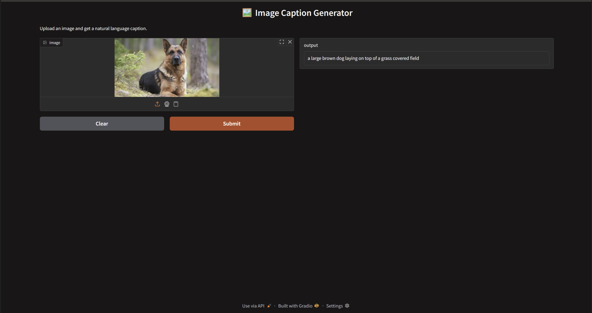

🌟 Image Captioning with Transformer Decoder + ResNet-50 Encoder

This project implements an end-to-end Image Caption Generator using a Transformer Decoder and a pre-trained ResNet-50 CNN Encoder. It supports beam search decoding, is trained on the MS COCO dataset, uses CUDA acceleration, and is deployed as a Gradio app for real-time caption generation from images.

💡 What This Project Does

Given an input image, the model generates a natural language description (caption). It combines:

Visual understanding via ResNet-50 feature extractor

Sequence generation via Transformer Decoder

Caption enhancement using Beam Search decoding

🎨 Sample Outputs

Image

Generated Caption

🐶 Dog

"a large brown dog laying on top of a grass covered field"

